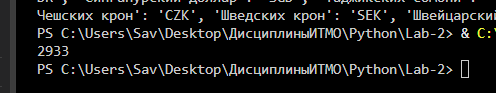
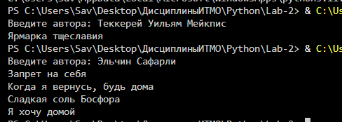
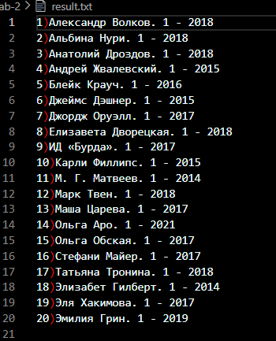
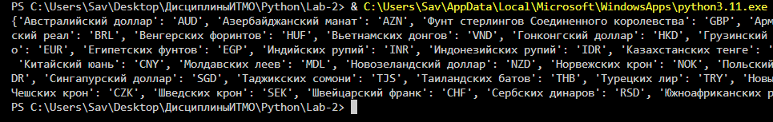

# Lab-2
## Лабораторная работа №2

**Вариант**

| Вариант | Ограничения books.csv | Ограничения books-en.csv | XML |
| 10 | От 2018 года | От 2000 года | Словарь "Name - CharCode" |

**Задание**

Используя приложенный файл ```books.csv``` ИЛИ ```books-en.csv```, выполнить следующее:  
* Вывести количество записей, у которых в поле ```Название``` строка длиннее 30 символов.


* Реализовать поиск книги по автору, использовать ограничение на выдачу в зависимости от варианта.


* Реализовать генератор библиографических ссылок вида ```<автор>. <название> - <год>``` для 20 записей. Записи выбрать произвольно. Список сохраняется как отдельный файл текстового формата с нумерацией строк.



* Распарсить файл и извлечь данные, согласно варианту. Выполнить приведения типов по необходимости.  
